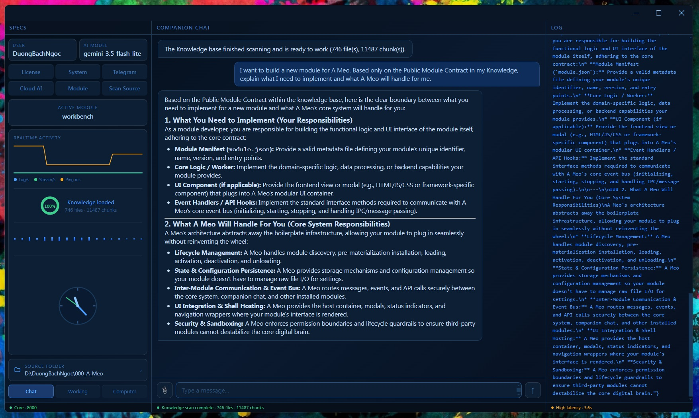
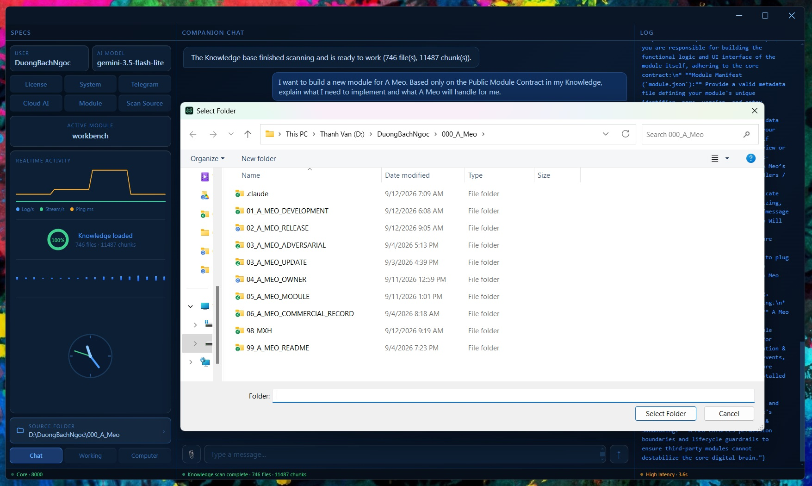
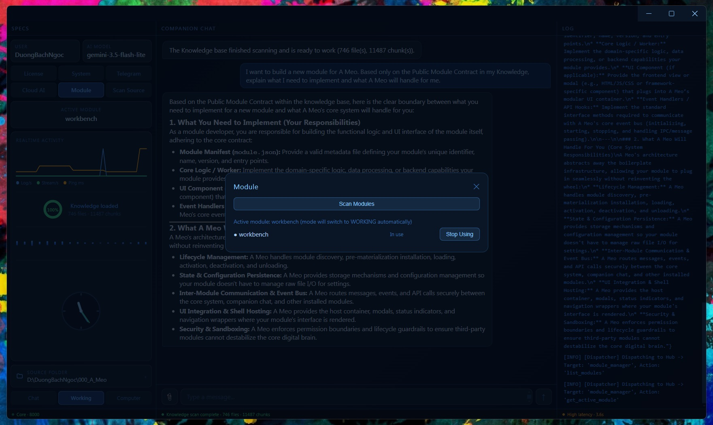

<p align="center">
  
</p>

<h1 align="center">A Meo</h1>

<h3 align="center">Personal AI Runtime Platform</h3>

<p align="center">
  <strong>Change the brain. Keep your Personal AI.</strong>
</p>

A Meo is a runtime for building and running a long-lived Personal AI — one that can keep its own knowledge, memory, state, working context, and capabilities independently of the AI model currently powering it.

Gemini, GPT, Claude, Qwen, or a local model can be the brain.

**The brain can change. Your Personal AI does not have to.**

<p align="center">
  
</p>

---

## Why A Meo?

Most AI products begin with a model:

> Which model should answer this request?

A Meo begins with a different question:

> **What would it take for one person to truly own a Personal AI that can grow with them over time?**

That leads to a different architecture.

A Meo separates:

- **Personal AI** from the **AI model**
- **Knowledge** from the **prompt**
- **Capabilities** from the **Core**
- **Modules** from the installation path
- **Interfaces** from the Personal AI itself
- **AI agency** from **Owner authority**

The central idea is simple:

> **One person. One A Meo.**

Two people may install the same version of A Meo today and, over time, end up with two very different Personal AIs — with different knowledge, memory, preferences, working state, and capabilities.

---

# Your Personal AI is not your AI model

A Meo treats the underlying AI model as a replaceable dependency rather than the identity of the assistant.

Need speed and low cost? Use a lighter model.

Need stronger reasoning? Switch to a more capable model.

Need privacy or offline operation? Use a local model.

When a better model becomes available, change the brain without rebuilding the Personal AI around it.

Your:

- Knowledge
- Memory
- Preferences
- Working State
- Modules
- Workflows
- Personal AI identity

do not have to disappear just because the model changes.

> **Change the brain. Keep your Personal AI.**

Capabilities that use A Meo's Host AI can also benefit as the underlying model improves, without requiring each capability to become a separate AI application.

---
### Personal Knowledge Runtime

A Meo can work with your existing knowledge sources without requiring you to reorganize your data around the AI.

<p align="center">
  
</p>

# Knowledge that lives beyond the context window

A Meo has its own Knowledge Runtime:

```text
Workspace
    ↓
Knowledge Source
    ↓
Folder / File
    ↓
Reader
    ↓
Chunk
    ↓
Index
    ↓
Search / Retrieval
    ↓
Context
    ↓
AI
```

A Knowledge Source can point directly to data that already exists on your machine.

You do not have to manually copy every document into every conversation.

Large documents can be chunked and indexed. When you ask something, A Meo retrieves the relevant material instead of trying to place your entire knowledge base inside the model's context window.

A Knowledge Source may contain hundreds or thousands of files while only the relevant pieces are brought into context for a particular task.

> **AI should come to your data — not force your data to move into the AI.**

---

# Local when you want it. Cloud when you need it.

A Meo is designed so local operation can be a real architectural choice.

When Knowledge, embeddings, and the AI model are configured locally, retrieval and inference can happen on the user's machine without sending document content to an online AI provider.

This is not a claim of absolute security. Real-world security still depends on the operating system, malware, backups and sync services, network configuration, third-party Modules, and user behavior.

But it gives the Owner an important choice:

> **Keep both the data and the inference environment local.**

When stronger cloud intelligence is preferred, A Meo can use an online model instead.

Because the model is separated from the Personal AI itself, local and cloud AI do not need to become two different Personal AIs.

---

# Modules

### Plug & Play Modules

Modules extend what your A Meo can do without modifying the Core.

<p align="center">
  
</p>

## Add a Module. Teach A Meo a new capability.

A Meo Core is not intended to contain every capability a person might ever need.

Specialized capabilities live outside the Core as **Modules**.

A Module can be small:

- a utility
- a document processor
- a specialized calculation
- a workflow automation

Or it can become much larger:

- a multi-step professional workflow
- an agent loop
- a deterministic domain engine
- a system with its own state and evidence
- an adapter to external software, APIs, databases, or devices
- a specialized professional capability

The important point is that the feature list of A Meo Core is **not the ceiling of what an A Meo can eventually do**.

> **Add a Module. A Meo learns another capability.**

---

## Plug & Play by design

A conforming A Meo Module is a self-contained installation unit.

The design goal is capability portability:

- **Plug & Play**
- **Path-independent**
- **No Core modification required**
- **No dependency on private Core implementation**
- **OS-independent by default when the domain itself is OS-independent**
- **Free to use the Host AI rather than owning a separate AI stack**

A Module should not care whether its author originally developed it on drive `C:`, `D:`, or somewhere else.

It should not depend on the current working directory or a fixed A Meo installation location.

And if its business logic is inherently portable, it should not introduce an unnecessary operating-system dependency.

Of course, a capability that controls Windows-only software or specialized hardware may legitimately be platform-specific.

The principle is not:

> Every Module must run everywhere.

It is:

> **Do not create a dependency that the domain itself does not require.**

---

## Public Module Contract

Third-party Module developers do **not** need access to A Meo's private Core implementation.

A Meo publishes a **Public Module Contract** describing the supported boundary between the Host and a Module.

The current public contract is:

> **A Meo Public Module Contract V1.3**

It defines, among other things:

- Module package layout
- manifest rules
- Module entry point
- capability interface
- user-turn handling
- optional attachment input
- artifact output
- Module lifecycle
- Host API access
- Module-owned persistent data
- dependency rules
- portability requirements
- failure and safety obligations

The implementation of the Core remains private.

**The boundary is public.**

This allows Modules and Core to evolve with less coupling while giving Module developers a documented compatibility surface.

---

# Build a capability without rebuilding an AI application

Creating a standalone AI application often means solving much more than the actual domain problem:

```text
AI provider integration
Model configuration
API keys
Knowledge
Retrieval
Embeddings
Memory
Persistence
Backend
Streaming
Communication
Runtime lifecycle
Agent infrastructure
Approval / Policy
Logging
Packaging
...
```

A Meo is intended to provide the common runtime so a Module developer can focus primarily on:

> **Domain Logic + Capability + Workflow**

A Module can also use A Meo's Host AI through the public boundary, so every specialized capability does not necessarily need its own provider integration, API key management, or inference backend.

---

# Coding AI changes who can build software

Historically, saying:

> "Users can build their own plugins."

usually meant:

> "Programmers can build plugins."

Coding AI changes that boundary.

A domain expert can describe the capability they need, provide the **A Meo Public Module Contract**, define business rules, inputs, outputs, examples and expected behavior, then use a coding AI to help implement and test the Module.

That does **not** mean every person can safely build every kind of software with a single prompt.

Code still needs testing. High-impact capabilities still deserve careful review.

But the role of the user can change dramatically.

The user can become:

> **Domain Expert + Product Owner**

while coding AI performs much of the implementation work.

A new capability can begin with a sentence as simple as:

> **"I want my A Meo to know how to do this."**

---

# Micro-software for one person

Traditional software usually needs enough users to justify the cost of building it.

Coding AI changes that economics.

A capability that is useful to exactly **one person** can now be worth creating.

For example:

- one office's project organization rules
- one architect's drawing-check workflow
- one company's estimation method
- one person's weekly reporting process
- one project's naming conventions
- one writer's consistency checker
- one highly specialized workflow that would never justify a commercial SaaS product

A Meo provides a common runtime for these small, deeply personal pieces of software.

They do not all need to become separate AI applications.

They can become capabilities of the same Personal AI.

---

# One Personal AI. Many professions.

Instead of:

```text
AI App A → Documents
AI App B → Estimation
AI App C → Writing
AI App D → Architecture
AI App E → Automation
```

A Meo is designed toward:

```text
                    ┌── Workbench
                    ├── Estimation
One Personal AI ────┼── Writing capability
                    ├── Architecture capability
                    ├── Automation capability
                    └── Your next Module...
```

Personal identity, Knowledge infrastructure, Host AI, and runtime remain at the platform level.

Domain logic remains inside specialized Modules.

A Meo can therefore learn new "professions" without turning its Core into a monolithic collection of every profession's business logic.

---

# Memory, State, and continuity

A Personal AI is more than a model plus a system prompt.

A Meo maintains persistent state related to areas such as:

- Owner
- Preferences
- Workspace
- Knowledge
- Conversation history
- Working profile

The goal is continuity across sessions.

Closing a chat window should not have to mean losing the Personal AI.

Changing the underlying model should not have to mean creating a new Personal AI.

Over time, the same A Meo can accumulate more Knowledge, more context, more preferences, and more capabilities.

---

# Adaptive Intelligence

A Meo is also designed to learn more than static facts about its Owner.

Its Adaptive Intelligence / Working Profile direction is about gradually understanding things such as:

- how the Owner prefers to work
- response preferences
- recurring workflows
- previously confirmed choices
- operational context

This creates another path for improvement.

A Meo can become better because the underlying AI model improves.

But **your A Meo** can also become better simply because it understands **you** better over time.

---

# From conversation to work

A Meo does not treat every request as:

```text
User message → LLM → Text response
```

Different requests can follow different runtime paths involving conversation, Knowledge, Modules, onboarding, actions, approvals, orchestration, context, and identity.

The principle is simple:

> **Use AI where reasoning is useful. Keep deterministic things deterministic.**

---

# Orchestration

A Meo includes an Orchestrator for workflows that go beyond answering a question.

A workflow may follow a pattern such as:

```text
Goal
  ↓
Decide
  ↓
Action
  ↓
Capability
  ↓
Artifact
  ↓
Verify
  ↓
Checkpoint
  ↓
Continue
```

If information is missing, the workflow can ask the Owner.

If an action requires approval, execution can pause and continue after authorization.

The goal is to move from:

> "Here is how you could do it."

toward:

> **"I can participate in doing it."**

---

# AI Agency. Owner Authority.

A Meo is not built around the idea that more autonomous AI is automatically better.

The principle is:

> **AI can have Agency. The Owner keeps Authority.**

Actions can be subject to policy and approval.

Approval belongs to the relevant action and payload rather than becoming a permanent blanket permission.

This distinction becomes increasingly important when an AI moves beyond conversation and begins affecting the outside world.

---

# Evidence and Verification

An AI model being confident is not the same thing as having evidence.

A Meo therefore includes a verification layer intended to separate model confidence from actual support.

Depending on the workflow, this can involve mechanisms such as:

- deterministic verification
- semantic verification
- evidence checking
- numeric claim gates
- rejection of invalid evidence
- downgrading unsupported claims
- abstention when suitable evidence is unavailable

The goal is not to claim that hallucination can be eliminated completely.

The goal is to give the runtime additional ways to ask:

> **"Do we actually have support for this claim?"**

---

# Automation Runtime

A Meo includes runtime primitives for scheduled and persistent automation, including concepts such as:

- job registration
- intervals
- pause / resume
- persisted scheduler state
- restoration after restart
- capability invocation through the runtime

This provides a foundation for a Personal AI that does not have to operate only in the pattern:

```text
Human asks → AI answers
```

It can also support workflows where capabilities run at the appropriate time or condition.

---

# One A Meo. Multiple interfaces.

The Desktop GUI is not A Meo itself.

It is a client of the A Meo runtime.

Other interfaces can lead to the same Personal AI and the same underlying runtime rather than creating an entirely separate bot with separate state.

The architectural direction is:

```text
Desktop ─┐
Telegram ├──→ A Meo Runtime
Future   ┘
             │
             ├── Personal State
             ├── Knowledge
             ├── AI
             ├── Modules
             └── Orchestration
```

A Meo currently distinguishes interaction modes with different meanings:

- **CHAT** — talk with A Meo
- **WORKING** — work with an active capability / Module
- **COMPUTER** — the interaction mode for computer-oriented work

---

# Artifacts, not just text

Useful AI output is not always text.

A Meo uses a general **Artifact** concept for results such as:

- documents
- files
- images
- audio
- video
- binary output

The public Module boundary also supports optional file/media attachment input and Artifact output.

This keeps media-specific capability logic from needing to become hardcoded Core behavior.

---

# Failure isolation and resilience

A Meo is designed to reduce the blast radius between subsystems.

Examples include:

- Module process isolation
- lexical fallback when semantic retrieval is unavailable
- background Knowledge indexing
- GUI separated from the backend runtime
- provider failures reported as failures rather than fake successes
- Module failures contained at the Module boundary

A Module crashing should not automatically mean A Meo itself must crash.

---

# Complex inside. Simple outside.

A Meo contains multiple runtime systems:

```text
AI Providers
Knowledge
Retrieval
Embeddings
Memory
Persistence
Module Runtime
Process Management
Orchestration
Policy
Verification
Automation
Communication
GUI / Backend
Logging
...
```

But the user should not need to understand all of that before using a Personal AI.

The product direction is to package the required runtime environment and guide initial configuration through onboarding, rather than requiring the user to clone an AI project and manually construct a development environment.

> **It can be complex inside. It should feel simple outside.**

---

# What A Meo is not trying to be

A Meo is intentionally centered on a **Personal AI for one person**.

It is not trying to turn every internal boundary into a distributed enterprise platform designed for thousands of users and teams.

Boundaries that matter are still protected:

```text
Core       ↔ Module
AI         ↔ Policy
Action     ↔ Approval
Claim      ↔ Evidence
Runtime    ↔ Interface
```

But a workflow serving one person on one machine should not automatically inherit the architectural complexity of a large enterprise system.

That scope is deliberate.

---

# Architecture at a glance

```text
┌─────────────────────────────────────────────────────────┐
│                       INTERFACES                        │
│              Desktop / Telegram / Future                │
└───────────────────────────┬─────────────────────────────┘
                            │
┌───────────────────────────▼─────────────────────────────┐
│                       A MEO CORE                        │
│                                                         │
│   Personal State     Knowledge        AI Providers      │
│   Memory             Retrieval        Local / Cloud     │
│                                                         │
│   Routing            Orchestrator     Policy Gate       │
│   Verification       Automation       Communication     │
│                                                         │
└───────────────────────────┬─────────────────────────────┘
                            │
                    Public Module Boundary
                            │
          ┌─────────────────┼─────────────────┐
          │                 │                 │
          ▼                 ▼                 ▼
      Module A          Module B          Module C
      Workbench         Estimation        Your Module
```

This is a conceptual overview, not a description of A Meo's private Core implementation.

---

# Public Module Contract V1.3

The **A Meo Public Module Contract V1.3** is the current official public boundary for third-party Modules.

A Module author should be able to work from that Contract without knowledge of A Meo's private implementation.

A minimal Module contains:

```text
modules/
└── <module_id>/
    ├── module_manifest.json
    ├── boot.py
    └── ...
```

A conforming Module must not require edits to A Meo files, configuration, release artifacts, or other Modules.

The Contract also defines:

- portability rules
- Host invocation
- persistent Module-owned data
- lifecycle behavior
- attachment input
- Artifact output
- failure handling

The complete **Public Module Contract V1.3** is published with the A Meo public documentation.

---

# Build your own Module

A typical development path is:

```text
Define the capability you want
        ↓
Read / provide the Public Module Contract
        ↓
Describe domain rules, inputs and outputs
        ↓
Implement the Module
— manually or with coding AI
        ↓
Test it
        ↓
Install the Module into A Meo
        ↓
Scan → Integrate → Activate
        ↓
A Meo has a new capability
```

No private Core source is required for conforming third-party Module development.

---

# Download A Meo

Official A Meo releases are distributed through the **Releases** section of this repository.

## Windows

Download the latest Windows installer from **GitHub Releases**.

Install it like a normal Windows desktop application.

## macOS

Download the latest macOS installer from **GitHub Releases**.

> **Always download A Meo from this official repository.**
>
> Do not install binaries distributed through unofficial third-party sources.

Release packages may include cryptographic checksums so downloaded installers can be verified before installation.

---

# Get a Free CD-Key

A Meo currently requires a CD-Key for activation.

During the public testing period, **CD-Keys are provided free of charge**.

To request a CD-Key, contact:

**Email:** duongbachngoc.shv@gmail.com

Please include:

- Your name or GitHub username
- Your operating system
- A short note saying that you would like to test A Meo

You will receive a CD-Key that can be entered directly into A Meo's activation screen.

> CD-Keys are currently issued manually, so delivery may not be immediate.

---

# Quick Start

Getting started with A Meo is designed to be simple:

1. Download the installer for your operating system.
2. Request a **free CD-Key** using the instructions above.
3. Install A Meo like a normal desktop application.
4. Launch A Meo and enter your CD-Key when requested.
5. Complete the initial onboarding.
6. Configure an online AI provider or a local AI model.
7. Point A Meo to the Knowledge Sources you want it to use.
8. Start talking and working with your Personal AI.
9. Add Modules whenever you want A Meo to learn a new capability.
# Quick Start

Getting started with A Meo is designed to be simple:

1. Download the installer for your operating system.
2. Install A Meo like a normal desktop application.
3. Launch A Meo and complete the initial onboarding.
4. Configure an online AI provider or a local AI model.
5. Point A Meo to the Knowledge Sources you want it to use.
6. Start talking and working with your Personal AI.
7. Add Modules whenever you want A Meo to learn a new capability.

You do not need the A Meo Core source code to use the application.

You also do not need the private Core source to develop a conforming third-party Module — the Public Module Contract defines the supported boundary.

---

# Source Availability

A Meo follows a:

> **Public Contract / Private Core**

model.

This repository is intended to provide public resources such as:

- product documentation
- Public Module Contract
- Module development documentation
- reference / example Module material
- official release information
- resources required to use and extend A Meo

The private A Meo Core implementation is **not published as open source** by this repository.

Public documentation or example Modules should not be interpreted as granting rights to the private A Meo Core implementation.

---

# License

**A Meo Core is proprietary software.**

The Public Module Contract, example Modules, documentation, and other public materials may have their own explicitly stated terms.

Unless explicitly stated otherwise, no open-source license is granted for the private A Meo Core.

Refer to the applicable A Meo license terms distributed with the software for the rights and restrictions governing use of A Meo.

---

# Project Status

A Meo is under active development and is available for public testing.

The current public Module boundary is:

> **A Meo Public Module Contract V1.3**

Future releases may improve the runtime, interfaces, Knowledge system, AI integrations, and other platform capabilities while preserving the documented compatibility boundary for conforming Modules.

---

# Why this project exists

A Meo did not begin as an attempt to build another general-purpose chatbot.

It began from a practical problem.

One person may work across many domains, projects, documents, tools, and workflows.

Using a separate AI application for every task means repeatedly rebuilding context, moving data around, re-explaining preferences, and fragmenting knowledge across different systems.

A Meo explores a different possibility:

> **What if the stable thing were not the model or the app — but your Personal AI itself?**

Models can change.

Knowledge can grow.

Memory can accumulate.

Capabilities can be added.

Interfaces can evolve.

But the Personal AI can continue.

---

# One person. One A Meo.

A Meo is not designed to become the same AI for everyone.

It is designed so that each person's A Meo can become increasingly their own.

> **A Meo today is not the most interesting question.**
>
> **The more interesting question is:**
>
> ### What do you want your A Meo to know how to do tomorrow?

---

## A Meo — Personal AI Runtime Platform

### **Change the brain. Keep your Personal AI.**
